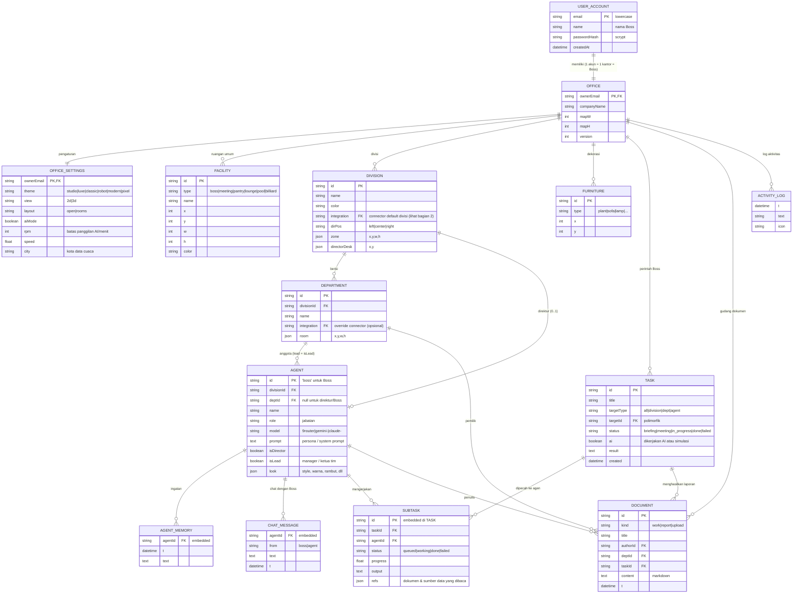
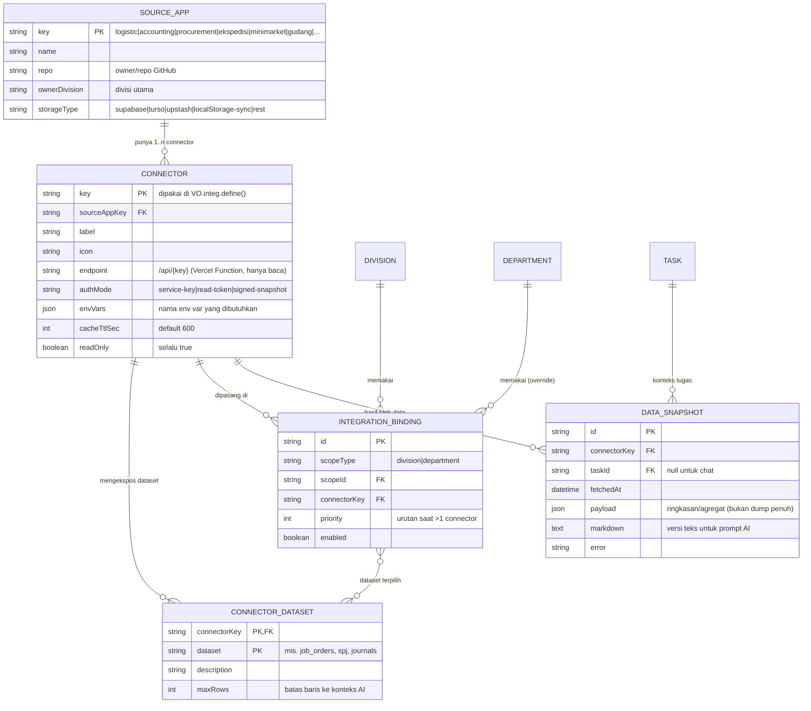
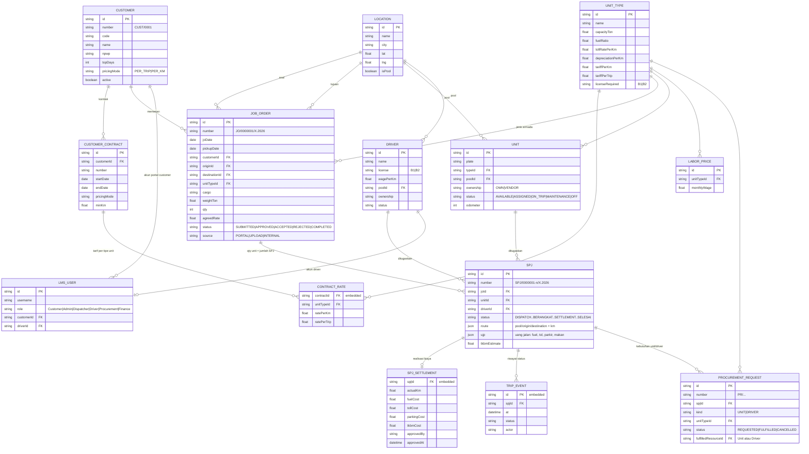
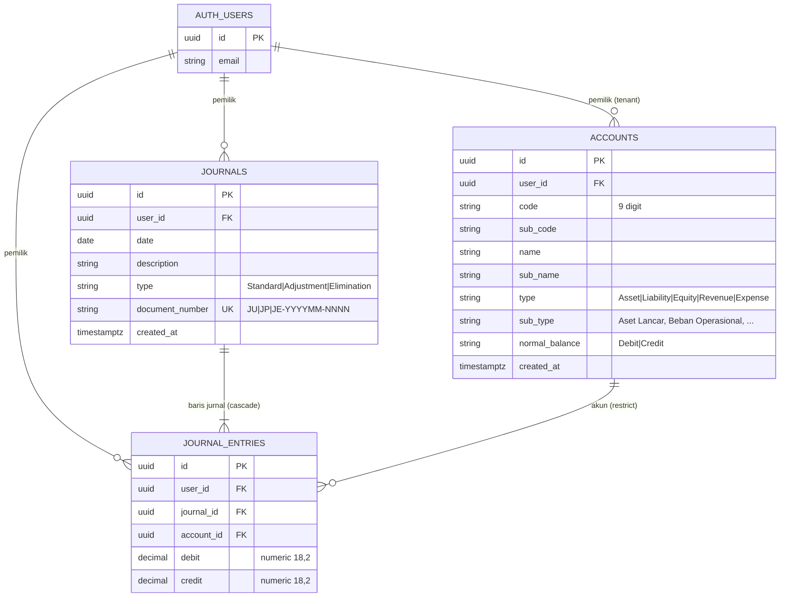
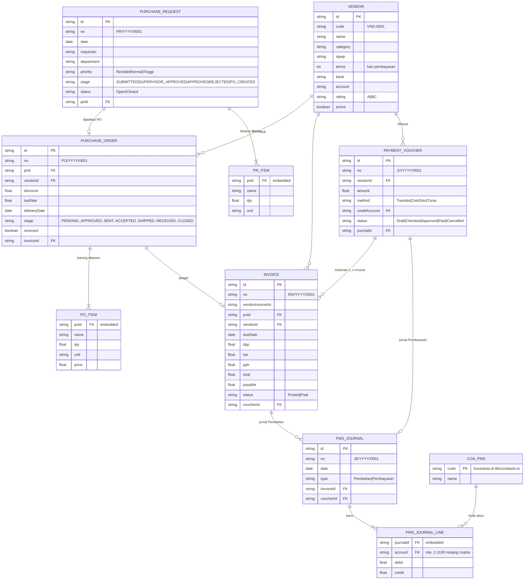
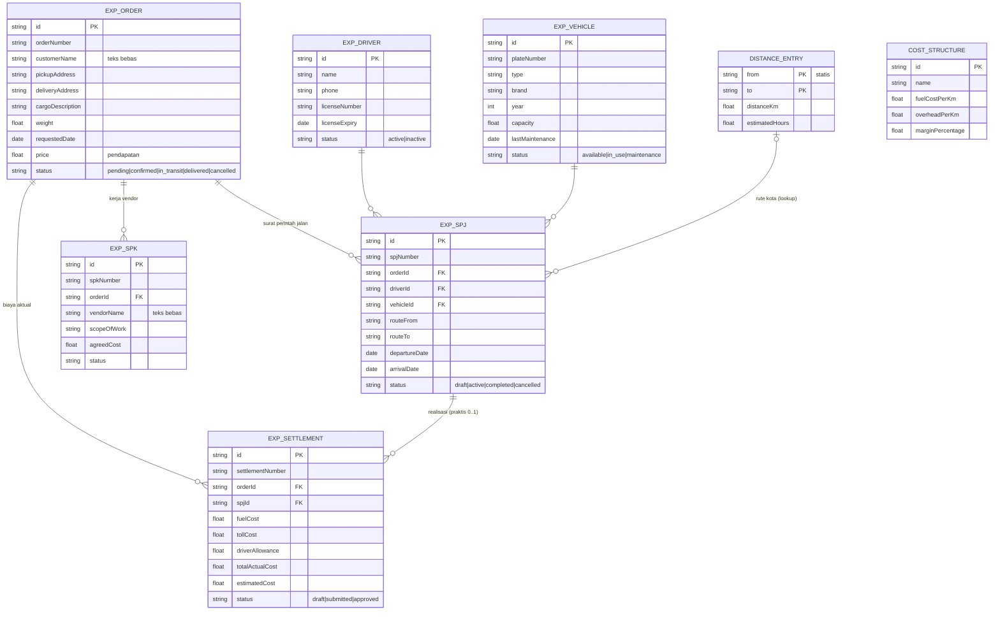
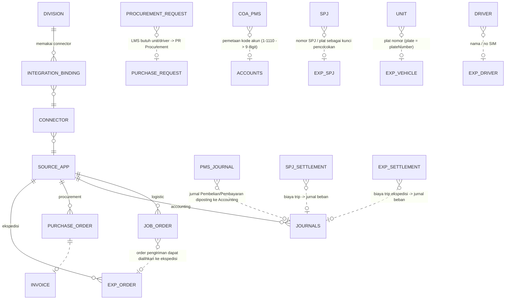

# ERD — Visual Office & Integrasi Aplikasi Divisi

Dokumen ini menggambarkan struktur data **Visual Office** (kantor agen AI) dan bagaimana setiap
divisi menarik data (hanya baca) dari aplikasi operasional:

| Divisi | Aplikasi sumber | Repo | Penyimpanan data saat ini |
|---|---|---|---|
| Logistic | Logistic Management System | `RifqiFachruradzi/logistic-management-system` | Browser `localStorage` key `lms-store-trial-v1` (Zustand) |
| Accounting | Laporan Keuangan App | `RifqiFachruradzi/laporan-keuangan-app` | **Supabase Postgres** (tabel `accounts`, `journals`, `journal_entries`, RLS per `user_id`) |
| Procurement | Procurement Management System | `RifqiFachruradzi/procurement-management-system` | Browser `localStorage` key `procura.pms.v2` (Zustand, versi 3) |
| Ekspedisi | Ekspedisi App | `RifqiFachruradzi/ekspedisi-app` | Browser `localStorage` key `ekspedisi-app-state` |
| _(sudah ada)_ Minimarket | MiniMarket APP | `RifqiFachruradzi/MIniMarket-APP` | Turso / libSQL |
| _(sudah ada)_ Gudang | Gudang-Document | `RifqiFachruradzi/Gudang-Document` | Upstash Redis `gudang:*` |
| _(berikutnya)_ … | aplikasi baru | — | didaftarkan lewat **Connector Registry** (lihat bagian 2) |

Isi dokumen:
1. [ERD inti Visual Office](#1-erd-inti-visual-office)
2. [ERD lapisan integrasi (extensible, banyak aplikasi per divisi)](#2-erd-lapisan-integrasi)
3. [ERD aplikasi sumber](#3-erd-aplikasi-sumber) — Logistic, Accounting, Procurement, Ekspedisi
4. [Relasi lintas aplikasi (alur bisnis)](#4-relasi-lintas-aplikasi)
5. [Kamus data ringkas & catatan teknis integrasi](#5-catatan-teknis-integrasi)

> Notasi: diagram memakai Mermaid `erDiagram` (tampil otomatis di GitHub). Versi gambar PNG ada di folder [`docs/erd/`](erd/).
> `PK` primary key, `FK` foreign key, `UK` unique. Entitas bertanda _embedded_ disimpan di dalam
> dokumen JSON induknya (bukan tabel terpisah) tetapi digambar sebagai entitas agar relasinya jelas.

---

## 1. ERD inti Visual Office

Visual Office menyimpan satu dokumen kantor per akun di Upstash Redis
(`visualoffice:office:<email>`), dokumen di hash `visualoffice:docs:<email>`, dan akun di
`visualoffice:users`. Secara logis strukturnya:

**Aturan bisnis penting**
- Hierarki perintah: **Boss → Direktur (DIVISION) → Lead (DEPARTMENT, `isLead`) → Anggota**.
- `TASK.targetType/targetId` polimorfik: `division` → `DIVISION.id`, `dept` → `DEPARTMENT.id`, `agent` → `AGENT.id`, `all` → seluruh kantor.
- Integrasi data berlaku **turun-temurun**: `DEPARTMENT.integration` (bila ada) menimpa `DIVISION.integration`; direktur memakai integrasi divisinya.

---

## 2. ERD lapisan integrasi

Saat ini satu divisi/departemen hanya bisa menunjuk **satu** connector (`integration` = string).
Karena tiap divisi nantinya bisa memakai **lebih dari satu aplikasi**, desain targetnya adalah
**registry connector + tabel penghubung (N:M)**:

**Cara menambah aplikasi baru untuk sebuah divisi (tanpa mengubah skema):**
1. Tambah 1 baris `SOURCE_APP` + `CONNECTOR` (kode: `lib/<app>.js`, `api/<app>.js`, `js/<app>.js` lewat `VO.integ.define`).
2. Tambah `INTEGRATION_BINDING` ke divisi/departemen yang membutuhkan (bisa lebih dari satu per divisi).
3. Agen otomatis menerima data semua binding aktifnya sebagai konteks tugas & chat.

> Migrasi dari model sekarang: nilai `DIVISION.integration` / `DEPARTMENT.integration` lama menjadi
> satu `INTEGRATION_BINDING` dengan `priority = 0`.

---

## 3. ERD aplikasi sumber

### 3a. Divisi Logistic — `logistic-management-system`

Sumber: `src/lib/types.ts`, `src/store/useStore.ts` · localStorage `lms-store-trial-v1`.

### 3b. Divisi Accounting — `laporan-keuangan-app`

Sumber: `supabase/schema.sql` · Supabase Postgres (RLS: `user_id = auth.uid()`).

Laporan (neraca, laba rugi, umur piutang/hutang) dihitung dari `journal_entries` — bukan tabel.

### 3c. Divisi Procurement — `procurement-management-system`

Sumber: `lib/types.ts`, `lib/ops.ts` · localStorage `procura.pms.v2`.

### 3d. Divisi Ekspedisi — `ekspedisi-app`

Sumber: `src/lib/types.ts`, `src/contexts/app-context.tsx` · localStorage `ekspedisi-app-state`.

`COST_STRUCTURE` berdiri sendiri (template tarif). Trip cost, trip revenue & laba rugi dihitung di halaman (bukan tabel).

---

## 4. Relasi lintas aplikasi

Relasi ini **konseptual** (belum ada FK nyata antar aplikasi). Inilah yang dipakai agen AI
untuk analisis lintas divisi — misalnya Direktur Keuangan membandingkan hutang dari Procurement
dengan jurnal di Accounting.

Garis putus-putus (`..`) = **kunci pencocokan bisnis** (nomor dokumen, plat, kode akun, nama), bukan FK fisik.

| Dari | Ke | Kunci pencocokan | Kegunaan agen AI |
|---|---|---|---|
| Logistic `PROCUREMENT_REQUEST` | Procurement `PURCHASE_REQUEST` | nomor PR / jenis unit | Lead time pengadaan armada |
| Procurement `PMS_JOURNAL_LINE.account` | Accounting `ACCOUNTS.code` | tabel mapping kode akun | Rekonsiliasi hutang usaha & PPN |
| Logistic `SPJ_SETTLEMENT` | Accounting `JOURNALS` | nomor SPJ di deskripsi jurnal | Cek biaya trip sudah dijurnal |
| Ekspedisi `EXP_SETTLEMENT` | Accounting `JOURNALS` | nomor settlement | Margin per trip vs pencatatan |
| Logistic `UNIT` | Ekspedisi `EXP_VEHICLE` | plat nomor | Utilisasi armada gabungan |
| Logistic `JOB_ORDER` | Ekspedisi `EXP_ORDER` | customer + tanggal + rute | Order yang di-subkon-kan |

---

## 5. Catatan teknis integrasi

### Kesiapan sumber data

| Aplikasi | Bisa dibaca server Visual Office? | Yang perlu dilakukan |
|---|---|---|
| **Accounting** (Supabase) | **Ya** | Buat role/kunci **read-only** (role Postgres `SELECT`-only atau service key + filter `user_id`). Env: `ACCOUNTING_SUPABASE_URL`, `ACCOUNTING_SUPABASE_KEY`, `ACCOUNTING_USER_ID`. |
| **Logistic** (localStorage) | **Tidak** — data hanya ada di browser pengguna | Tambah backend/sinkronisasi (lihat opsi di bawah). |
| **Procurement** (localStorage) | **Tidak** | Sama; aplikasi ini sudah punya *Backup JSON* yang formatnya bisa dipakai sebagai payload sinkron. |
| **Ekspedisi** (localStorage) | **Tidak** | Sama. |

### Opsi agar aplikasi localStorage bisa dibaca (rekomendasi: A)

- **A. Snapshot sync ke Upstash (paling ringan).** Tiap aplikasi menambah satu fungsi kecil yang,
  setiap ada perubahan, mengirim state JSON-nya ke endpoint
  `POST /api/sync/<app>` → disimpan sebagai `snapshot:<app>:<tenant>` di Upstash. Connector Visual
  Office membaca snapshot itu (hanya baca). Tanpa mengubah struktur data aplikasi.
- **B. Pindah ke database** (Supabase/Turso) seperti Accounting & MiniMarket — paling rapi untuk
  multi-user, tapi butuh refactor penyimpanan tiap aplikasi.
- **C. Upload manual** file *Backup JSON* ke Gudang Dokumen Visual Office — cepat untuk demo, tidak real-time.

### Prinsip connector (sama dengan Gudang & MiniMarket)
- **Hanya baca**; server Vercel yang mengambil data, kunci tidak pernah dikirim ke browser.
- Data diringkas (agregat + baris terbaru, dibatasi `maxRows`) sebelum masuk prompt AI.
- Cache per tugas 10 menit (`DATA_SNAPSHOT`) agar hemat kuota & konsisten antar anggota tim.
- Setiap laporan agen mencantumkan sumber & waktu pengambilan data.
